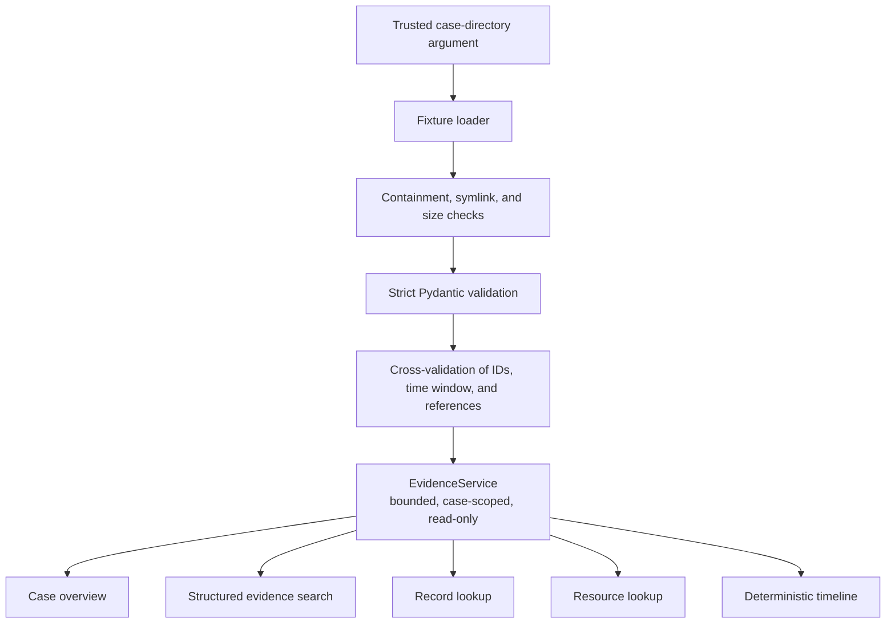
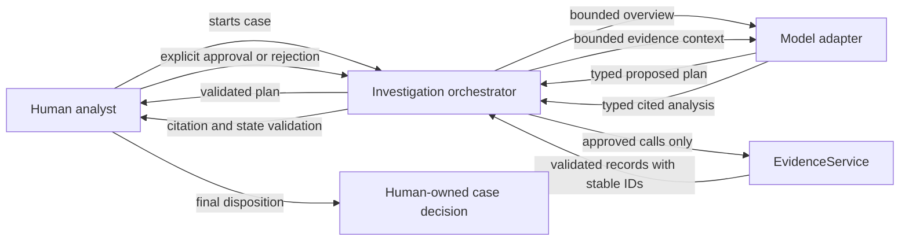
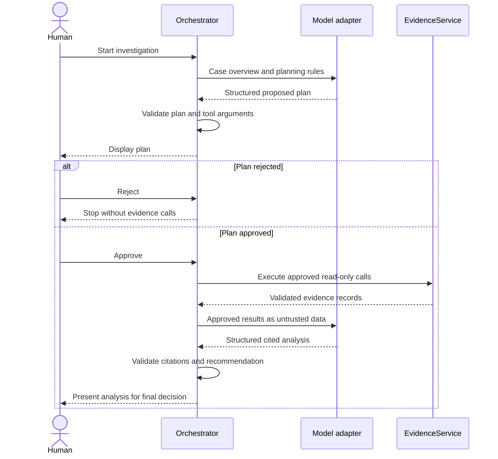

# Architecture

## Evidence Core

The implemented system is intentionally file-based and offline:

The command-line caller supplies a case directory. The fixture manifest may name only local JSON files. The loader rejects symbolic-link files, traversal, missing or oversized inputs, malformed models, mismatched case IDs, timestamps outside the case window, duplicate identifiers, and references to resources outside the bundle.

`EvidenceService` receives an already validated immutable `CaseBundle`. It cannot open files or reach a network. Searches use a fixed `EvidenceSearch` model rather than a query language and enforce the case's result limits and time window.

## Module Responsibilities

| Module | Responsibility | Explicitly does not do |
| --- | --- | --- |
| `domain.py` | Define immutable validated case, evidence, resource, search, overview, and timeline models | Load files, call providers, or infer incident meaning |
| `fixtures.py` | Resolve trusted fixture files and cross-validate the complete bundle | Accept paths from evidence or future model output |
| `tools.py` | Provide four bounded read-only operations over one bundle | Execute free-form queries, mutate evidence, or change case state |
| `investigation.py` | Define typed plans and analyses, enforce approval binding, execute approved calls, and validate citations | Trust prompt obedience or make the human decision |
| `model.py` | Provide deterministic offline and optional OpenAI structured-output adapters | Give a model direct tool access or expose provider errors verbatim |
| `artifacts.py` | Load validated plans and atomically write private local artifacts | Follow artifact symlinks or deserialize arbitrary objects |
| `reports.py` | Render provenance, cited analysis, and human decision as Markdown | Alter or infer investigation data |
| `cli.py` | Expose overview, timeline, two-stage planning, approval, and reporting | Bypass the orchestrator's approval and citation checks |
| `errors.py` | Provide stable expected error categories | Expose raw fixture content in error messages |

## Data Flow And Trust

The directory argument is a local operator input. File contents are untrusted even when committed to the repository. Validation changes their state from unparsed input to structurally valid evidence; it does not make their claims true or their embedded text trustworthy.

`EvidenceService` owns a deep copy of the validated bundle and returns deep copies from record and resource lookups. This prevents a caller holding either the original bundle or a prior result from mutating later query results. The service returns validated records rather than synthesized evidence, preserving stable IDs for later citation validation.

## Human/AI Boundary

The investigation orchestrator sits between a model adapter and `EvidenceService`.
The model proposes data requests; it does not invoke evidence operations itself.

The model adapter does not receive a filesystem path, shell, SQL interface, arbitrary HTTP client, or state-transition method. The fake adapter exercises the complete flow offline. The OpenAI adapter uses the Responses API only for schema-constrained plan and analysis output.

## Design Choices

- **JSON fixtures:** avoid another parser dependency in the evidence core.
- **No database:** one immutable case does not yet need persistence or concurrent access.
- **No generic repository interface:** there is only one concrete evidence source.
- **No autonomous tool loop:** separating proposal from execution produces a reviewable approval artifact and keeps the enforcement boundary visible.
- **No web framework yet:** the CLI proves the domain behavior before UI concerns are introduced.

These are current scope choices, not claims that the technologies are inherently inappropriate.
