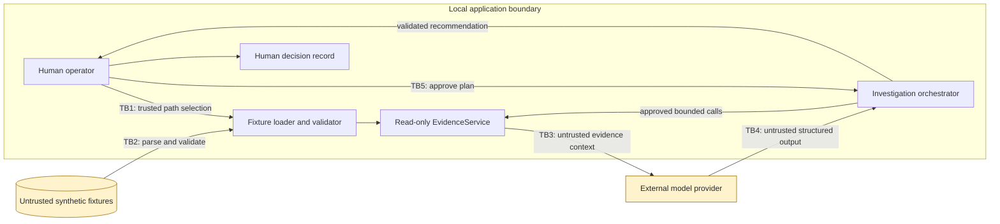

# Threat Model

## Scope

This document covers the evidence core and human/AI investigation boundary. Version 1 uses synthetic data only and has no live AWS, ticketing, shell, or remediation access. Model access is optional and limited to structured provider requests.

## Assets

- Integrity of the evidence bundle and its stable identifiers.
- Integrity of human approvals and final disposition.
- Separation between observed facts, AI inference, and human judgment.
- Model credentials and provider request data when a live adapter is added.
- Reliability of reports and evaluation results.

## Trust Boundaries

1. Local operator to case-directory loader.
2. Untrusted fixture bytes to validated domain models.
3. Validated evidence service to the model context.
4. Model output to application state and human-visible analysis.
5. Human approval to evidence-tool execution and final disposition.

Structural validation establishes format and references; it does not make a source statement trustworthy.

## Primary Threats And Current Controls

| Threat | Current control | Residual concern |
| --- | --- | --- |
| Path traversal through manifest filenames | Manifest accepts local `.json` basenames only; resolved files must remain under the case root | The operator can intentionally select any readable case directory; this is not a model capability |
| Symbolic-link escape | Case directory and referenced fixture files reject symbolic links | Platform-specific filesystem behavior needs CI coverage after publication |
| Resource exhaustion from fixtures | Two-megabyte file limit, bounded record/resource counts, bounded strings/lists, and bounded query results | Future model prompts need an additional context/token budget |
| Malformed or inconsistent evidence | Strict models, forbidden extra fields, aware timestamps, unique IDs, case-window checks, and resource-reference checks | Structurally valid evidence can still be false or misleading |
| Indirect prompt injection in evidence | Evidence remains untrusted; the model has no executable tools or state-changing operation; approval and citation gates are application-enforced; offline coverage includes instruction-like evidence | A model can still produce a misleading interpretation, so human review remains necessary |
| Arbitrary query execution | Fixed search fields; no SQL, regex, expression language, shell, or filesystem parameters | Repeated small queries may still collect the whole case; this is acceptable for synthetic version 1 but should be logged |
| Evidence tampering after validation | Frozen Pydantic models; service-owned deep copy; deep-copied query results; no mutation operations | Python callers deliberately reaching private attributes remain outside this non-hostile, single-process boundary |
| Unsupported incident claims | Every fact, hypothesis, and recommendation must cite an ID returned by the approved plan | Semantic support quality requires evaluation; a valid citation can still be irrelevant |
| Excessive AI agency | Model proposes typed calls; a reviewed saved plan requires explicit approval; app executes only bounded read-only calls; human disposition is separate | A human can approve a poor plan or accept a poor recommendation |
| Plan substitution | Saved plan is strictly revalidated and bound to case, provider, and model before execution | Local administrators can alter both code and artifacts and are outside this threat model |
| Secret leakage | Synthetic fixtures, `.env` exclusions, bounded provider errors, response storage disabled, and no credential requirement for offline use | Provider-side request handling and account retention settings remain external responsibilities |

## Implemented Human/AI Controls

- Structured plan and analysis schemas with size and enum limits.
- Human approval before executing the proposed evidence plan.
- Deterministic validation that cited evidence IDs exist.
- Separate storage for AI recommendations and human decisions.
- Fake model adapter for complete offline behavior and failure testing.
- Adversarial coverage proving an injected evidence string remains visible inert data and cannot close a case or expand tool access.

The investigation record also preserves the approved plan, validated executions, provider/model identity, approver, timestamps, analysis, and final human decision. Duration and failure-event telemetry remain future work.

## Out Of Scope

- Protection against malicious operating-system administrators.
- Multi-user authorization and tenant isolation.
- Production evidence retention and legal-hold requirements.
- Live cloud collection, containment, or remediation.
- Guarantees that a model will never generate an incorrect interpretation.

The project should state these limits directly rather than imply production assurance.
